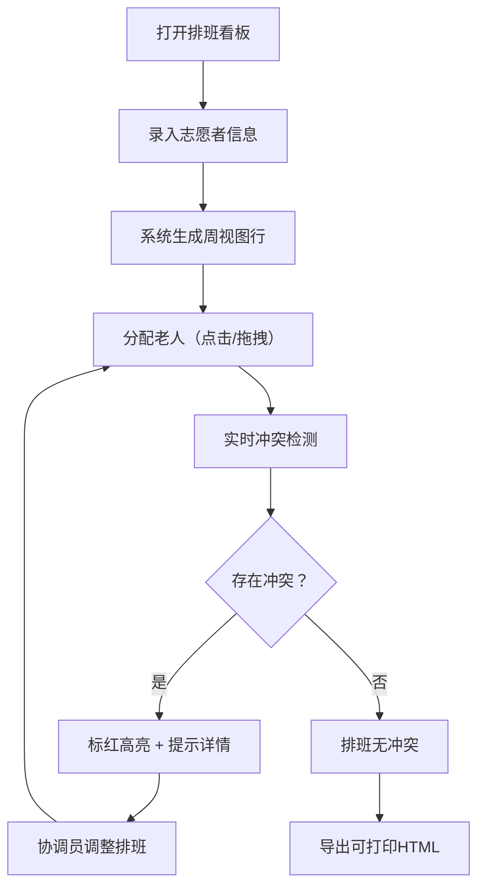

## 1. 产品概述

陪诊志愿者排班看板是面向街道养老站协调员的纯前端工具，用于直观管理志愿者陪诊排班、实时检测冲突，并支持拖拽调整与打印导出。

- 主要目的：帮助协调员肉眼识别排班冲突，高效分配志愿者陪同老人就医
- 解决问题：传统纸质排班或Excel表格难以快速发现时段冲突、人员超载、重复登记等问题
- 目标用户：街道养老站协调员（中老年群体，需高可读性界面）
- 产品价值：降低排班错误率，提升协调效率，保障老人就医陪同服务质量

## 2. 核心功能

### 2.1 用户角色

| 角色 | 注册方式 | 核心权限 |
|------|----------|----------|
| 协调员 | 无需注册，本地使用 | 志愿者信息录入、排班调整、冲突查看、导出打印 |

### 2.2 功能模块

1. **志愿者录入面板（左侧）**：志愿者基本信息、可服务日期、时段、陪诊上限人数
2. **周视图排班看板（中间）**：日历网格展示、志愿者行、老人分配展示、冲突高亮标红
3. **老人分配管理**：老人登记、拖拽跨志愿者/时段移动分配
4. **冲突实时检测**：时段冲突、人员超载、老人重复登记三类硬冲突
5. **导出打印（底部）**：生成可打印HTML排班表，含冲突摘要

### 2.3 页面详情

| 页面名称 | 模块名称 | 功能描述 |
|----------|----------|----------|
| 排班看板主页 | 志愿者录入表单 | 姓名输入、日期多选、时段选择（上午/下午/全天）、上限人数（1/2）、添加按钮 |
| 排班看板主页 | 志愿者列表 | 已录入志愿者卡片展示、删除操作 |
| 排班看板主页 | 周视图日历表头 | 本周7天日期显示、上一周/下一周切换、回到本周 |
| 排班看板主页 | 排班网格主体 | 志愿者×日期×时段的三维格子、老人姓名简写标签、拖拽源/目标高亮 |
| 排班看板主页 | 老人快速添加 | 点击空格子弹窗输入老人姓名完成分配 |
| 排班看板主页 | 冲突标红系统 | 三类冲突视觉高亮（红色边框/背景）、悬浮提示冲突详情 |
| 排班看板主页 | 导出按钮区 | 导出本周排班为可打印HTML、打印预览触发、冲突摘要展示 |

## 3. 核心流程

协调员打开页面后，先录入志愿者基本信息（姓名、可服务日期、时段、上限人数），系统自动生成周视图行。协调员点击空格子或拖拽将老人分配到对应志愿者的时段中，系统实时计算并标红冲突。调整完成后导出可打印HTML归档。

## 4. 用户界面设计

### 4.1 设计风格

- 主色调：温暖的医疗蓝（#1E88E5）作为主色，暖橙（#FF7043）作为强调色，背景米白（#FAF8F5）
- 冲突色：深红色（#D32F2F）背景配白色文字，确保老年人一眼识别
- 按钮风格：大圆角（12px）、高对比度、最小高度48px，适配中老年操作习惯
- 字体：中文采用「思源黑体 / Noto Sans SC」，正文最小16px，标题18-24px，行高1.6
- 布局风格：三栏式（左侧280px录入区 + 中间弹性区域日历 + 底部操作条），卡片化设计
- 图标：emoji风格图标（🏥 👴 📅 ⚠️），增强场景识别度

### 4.2 页面设计概述

| 页面名称 | 模块名称 | UI元素 |
|----------|----------|--------|
| 排班看板主页 | 志愿者录入表单 | 大输入框、多日期选择器、分段控件选时段、数字步进器、大号蓝色提交按钮 |
| 排班看板主页 | 志愿者卡片列表 | 浅灰卡片、姓名加粗、日期标签、时段徽章、删除图标（hover红色） |
| 排班看板主页 | 周视图日历 | 日期表头含星期+日期、周末列浅灰背景、格子边框实线1px、老人标签圆角小胶囊 |
| 排班看板主页 | 冲突高亮 | 冲突格子2px红色边框+浅红背景(#FFEBEE)、右上角⚠️角标、悬浮tooltip说明冲突类型 |
| 排班看板主页 | 拖拽交互 | 拖拽源半透明缩小、目标格子蓝色虚线边框+浅蓝背景、老人标签可拖拽光标 |
| 排班看板主页 | 底部操作条 | 固定底部、左侧冲突统计数字、右侧暖橙色大按钮「导出本周排班」 |

### 4.3 响应式

- 桌面优先设计，基准宽度1366px
- 最小支持宽度1024px，低于此宽度出现横向滚动条
- 无移动端适配需求（协调员使用办公电脑）
- 所有交互元素最小点击区域48×48px

### 4.4 打印样式

- 导出HTML内联所有CSS
- 隐藏交互元素（删除按钮、日期切换器）
- 冲突格子保留红色边框
- A4纸横向分页优化
- 页眉含「街道养老站陪诊排班表 + 日期范围」
