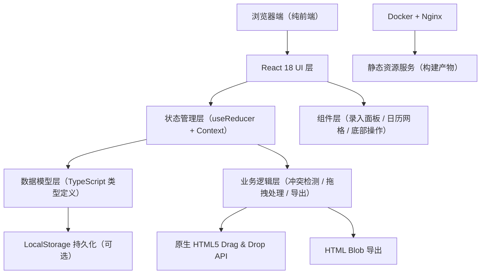
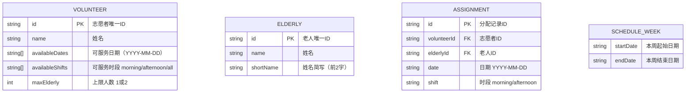

## 1. 架构设计



## 2. 技术描述

- **前端框架**：React@18 + TypeScript@5 + Vite@5
- **样式方案**：Tailwind CSS@3（原子化CSS，快速构建高对比度界面）
- **状态管理**：React 内置 useReducer + Context，避免引入额外依赖
- **拖拽实现**：原生 HTML5 Drag & Drop API（无需 react-dnd 等第三方库）
- **日期处理**：原生 Date API + 自定义工具函数（轻量周视图计算）
- **初始化工具**：`npm create vite@latest` 官方脚手架
- **后端**：无（纯浏览器端，LocalStorage 持久化可选）
- **数据库**：无（内存状态 + LocalStorage 可选）
- **构建产物**：Vite 构建 dist/ 目录，挂载至 Nginx 容器

## 3. 路由定义

| 路由 | 用途 |
|------|------|
| / | 排班看板主页（单页应用，无路由跳转） |

## 4. 数据模型

### 4.1 数据模型定义



### 4.2 核心类型定义（TypeScript）

```typescript
// 时段类型
type Shift = 'morning' | 'afternoon' | 'all';

// 冲突类型
type ConflictType = 
  | 'VOLUNTEER_DOUBLE_SHIFT'    // 志愿者同时段重复
  | 'ELDERLY_DOUBLE_BOOKED'     // 老人同日重复登记
  | 'VOLUNTEER_OVER_CAPACITY';  // 志愿者超员

// 志愿者
interface Volunteer {
  id: string;
  name: string;
  availableDates: string[];  // YYYY-MM-DD
  availableShifts: Shift[];
  maxElderly: 1 | 2;
}

// 老人
interface Elderly {
  id: string;
  name: string;
  shortName: string;
}

// 分配记录
interface Assignment {
  id: string;
  volunteerId: string;
  elderlyId: string;
  date: string;    // YYYY-MM-DD
  shift: 'morning' | 'afternoon';
}

// 冲突记录
interface Conflict {
  id: string;
  type: ConflictType;
  description: string;
  relatedAssignmentIds: string[];
  cellKey?: string;  // volunteerId + date + shift
}

// 应用全局状态
interface AppState {
  volunteers: Volunteer[];
  elderlyList: Elderly[];
  assignments: Assignment[];
  currentWeekStart: string;  // YYYY-MM-DD (周一)
}
```

### 4.3 状态管理 Action 类型

```typescript
type Action =
  | { type: 'ADD_VOLUNTEER'; payload: Omit<Volunteer, 'id'> }
  | { type: 'REMOVE_VOLUNTEER'; payload: string }
  | { type: 'ADD_ELDERLY'; payload: Omit<Elderly, 'id' | 'shortName'> }
  | { type: 'ADD_ASSIGNMENT'; payload: Omit<Assignment, 'id'> }
  | { type: 'REMOVE_ASSIGNMENT'; payload: string }
  | { type: 'MOVE_ASSIGNMENT'; payload: { assignmentId: string; newVolunteerId: string; newDate: string; newShift: 'morning' | 'afternoon' } }
  | { type: 'SET_CURRENT_WEEK'; payload: string }
  | { type: 'LOAD_STATE'; payload: AppState };
```

## 5. 冲突检测算法

### 5.1 三类硬冲突检测逻辑

**冲突1：志愿者同日同时段重复登记**
- 遍历 assignments，按 (volunteerId + date + shift) 分组
- 任意分组 size > 1 → 产生 VOLUNTEER_DOUBLE_SHIFT 冲突

**冲突2：老人同日被不同志愿者登记**
- 遍历 assignments，按 (elderlyId + date) 分组
- 任意分组中 volunteerId 不唯一 → 产生 ELDERLY_DOUBLE_BOOKED 冲突

**冲突3：志愿者当日登记人数超上限**
- 遍历 assignments，按 (volunteerId + date) 分组
- 获取该志愿者的 maxElderly
- 分组 size > maxElderly → 产生 VOLUNTEER_OVER_CAPACITY 冲突

### 5.2 性能优化

- 冲突检测仅在 assignments / volunteers 变化时触发（useMemo 缓存）
- 采用 Map 数据结构进行 O(n) 单次遍历检测
- cellKey 预计算：`${volunteerId}_${date}_${shift}`

## 6. 拖拽实现方案

- **Draggable 元素**：老人标签（elderly tag）
- **Droppable 区域**：所有排班格子（非志愿者不可服务日的格子置灰不可放置）
- **拖拽数据传递**：通过 `dataTransfer.setData('application/json', {...})` 传递 assignmentId
- **视觉反馈**：
  - dragstart：源元素半透明 opacity-50 scale-95
  - dragover：目标格子蓝色虚线边框 + 浅蓝背景
  - dragleave：清除目标格子样式
  - drop：触发 MOVE_ASSIGNMENT action

## 7. 导出可打印 HTML

- **导出内容**：
  1. 页眉：「XX街道养老站陪诊排班表」+ 本周日期范围
  2. 排班表格（含志愿者列、7天×2时段列）
  3. 冲突摘要区域（无冲突则显示「本周无硬冲突」）
- **实现方式**：
  - 构造完整 HTML 字符串（内联所有 CSS 样式）
  - 通过 `Blob` + `URL.createObjectURL` 触发下载
  - 文件命名：`陪诊排班表_YYYYMMDD-YYYYMMDD.html`
- **打印优化**：
  - `@page { size: landscape; margin: 15mm; }`
  - `@media print` 媒体查询适配 A4 横向
  - 表格 `page-break-inside: avoid`

## 8. Docker + Nginx 配置

### 8.1 Dockerfile

```dockerfile
FROM node:20-alpine AS builder
WORKDIR /app
COPY package*.json ./
RUN npm ci
COPY . .
RUN npm run build

FROM nginx:1.27-alpine
COPY --from=builder /app/dist /usr/share/nginx/html
COPY nginx.conf /etc/nginx/conf.d/default.conf
EXPOSE 80
CMD ["nginx", "-g", "daemon off;"]
```

### 8.2 nginx.conf

```nginx
server {
    listen 80;
    server_name localhost;
    root /usr/share/nginx/html;
    index index.html;

    location / {
        try_files $uri $uri/ /index.html;
    }

    location ~* \.(js|css|png|jpg|jpeg|gif|ico|svg|woff|woff2)$ {
        expires 30d;
        add_header Cache-Control "public, immutable";
    }
}
```

### 8.3 .dockerignore

```
node_modules
.git
.gitignore
*.md
!README.md
.trae
.env*
npm-debug.log*
dist
```
